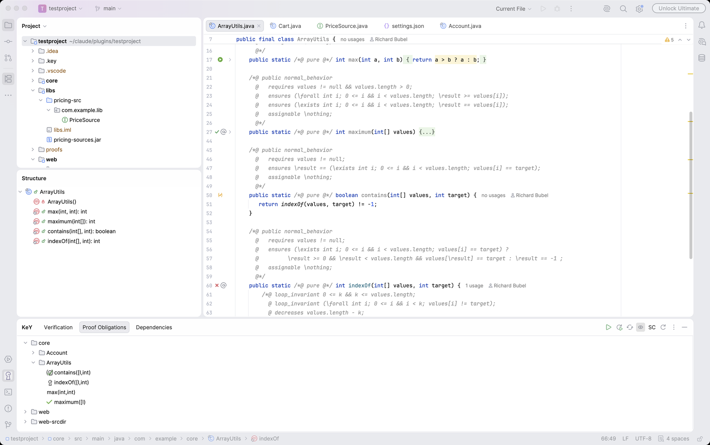
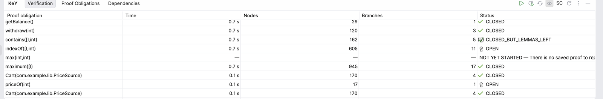
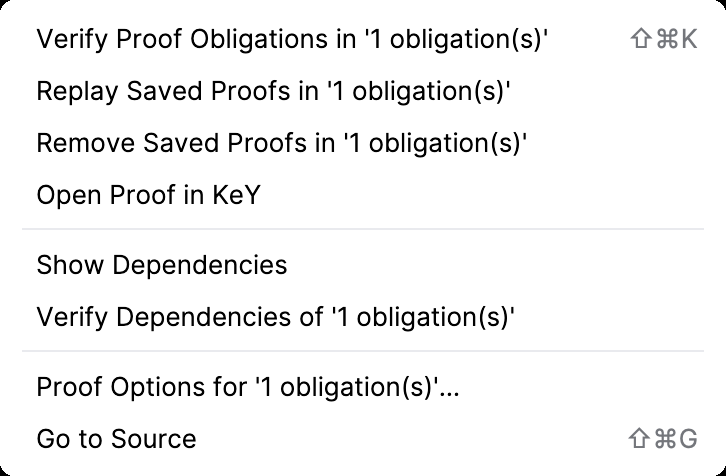
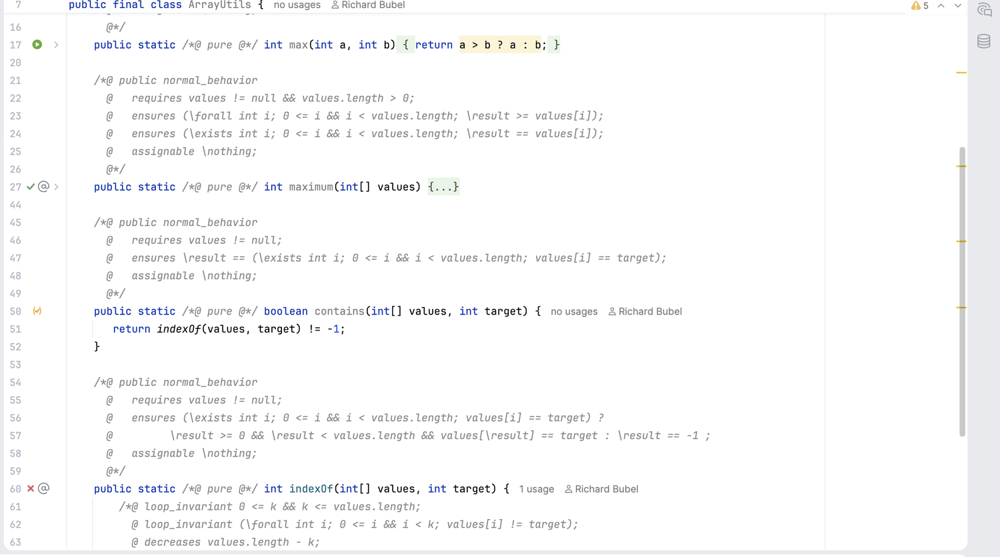

# The interface

Everything the plugin adds, and what it means.

## The KeY tool window

It sits at the bottom, where a wide window belongs: the verification table has six columns
worth comparing across. It has three tabs, and like any tool window it can be moved wherever
it suits.

The Proof Obligations tab, with `contains` closed but for lemmas, `indexOf` open, `max` not
attempted and `maximum` closed. The gutter beside the editor carries the same verdicts, and
the toolbar is at the right of the tab strip.

### Verification

What the project's proofs are worth, as the last run and the last listing left them. One
row per proof obligation, with its state, how large the proof is, how many branches it has,
and how long the attempt took. A run replaces the rows it attempted, so the measurements
survive a refresh.

Where a saved proof was made under settings that differ from the ones configured now, the
status cell carries a **settings differ** link; pressing it shows which options differ,
what the proof was made with, and what it would be attempted with today.

### Proof Obligations

Everything the project can be asked to prove, by context, then class, then method. A method
with several specification cases gets a row per case underneath it.

Right-clicking a row offers, on that row and on every row selected with it:

| Action | What it does |
|---|---|
| **Verify Proof Obligations** | prove them, without opening KeY |
| **Replay Saved Proofs** | read the saved proofs back and report what they are |
| **Remove Saved Proofs** | delete the proof files |
| **Open Proof in KeY** | open the proof in a KeY window of its own, to look at it |
| **Show Dependencies** | fill the Dependencies tab with what this proof rests on |
| **Verify Dependencies** | prove what it rests on and is not proved |
| **Proof Options…** | the taclet and strategy options this selection is proved with |
| **Go to Source** | open the class at the declaration the contract belongs to |

### Dependencies

What one proof rests on, as KeY reported it: the contracts its proof used, and what those
used in turn. It is filled by **Show Dependencies** and follows the proofs as they change.

## The toolbar

| Button | What it does |
|---|---|
| **Verify Everything** | a run per context, over every obligation it has |
| **Replay Every Saved Proof** | read every saved proof back |
| **Refresh** | list the project again |
| **Verify on Save** | turn keeping the proofs up with the sources on and off |
| **SC** / **MT 4x** | which prover runs the proofs; click to switch between single and multi core, right-click to choose the number of workers |
| **Restart KeY Bridge** | stop the KeY the plugin drives and start it again |

## Marks in the gutter

Beside every method that has a contract, and beside its class:

| Mark | What it means |
|---|---|
| green check | every proof obligation of that method is closed |
| orange check in brackets | closed, but it rests on contracts that are not proved themselves |
| red cross | at least one obligation has goals left |
| { width="18" } | KeY has judged nothing here yet; press it to verify |

The three checks are painted by the plugin rather than read from a file, so they follow the
IDE's own light and dark themes and are drawn at whatever size the gutter asks for.

A class carries the weakest mark of everything in it, so it turns green only when the whole
class is proved. Hovering a mark says what it means, and pressing one offers the same
actions as the tool window.

## Status icons

The icons in the tables and trees are KeY's own, fetched from the KeY you configured, so a
state means in the IDE exactly what it means in KeY:

| Icon | State | Meaning |
|---|---|---|
| { width="18" } | `OPEN` | the proof has goals left |
| { width="18" } | `CLOSED_BUT_LEMMAS_LEFT` | proved, but it uses contracts that are not proved themselves |
| { width="18" } | `CLOSED` | proved |
| { width="18" } | `CLOSED_BY_CACHE` | proved, reusing a cached proof |
| { width="18" } | `SAVED` | a proof is saved but has not been replayed against the current sources |
| nothing | `NONE` | no proof exists for this contract |

KeY also draws a continue button, { width="18" }, which
stands for no state: it appears where KeY has judged nothing yet and offers to start a proof.

The two states KeY has no keyhole for share its question mark, which it draws as a dark
glyph. The bridge serves a set per theme — { width="18" } for
a light one and { width="18" } for a dark one —
and the plugin shows the one the IDE's theme asks for, so it is legible under either
and changes with the theme.

## Where the actions live

- **Editor**, right-click: **Verify Proof Obligations** for the method at the caret, and
  the **KeY** submenu for the rest. A caret in no method means the whole file.
- **Project view**, right-click: the same, for a file, a package or a directory — every
  obligation under the selection.
- **Gutter**, press a mark: the same, for that method or class.
- **KeY tool window**: the same, for the selected rows.

## Notifications and progress

A run appears as a background task with a progress bar that can be stopped; stopping keeps
what was proved before the stop. The result is one line: how many of how many were proved,
and which were left open. Failures are shown the same way, saying what actually went wrong
rather than that something did.
