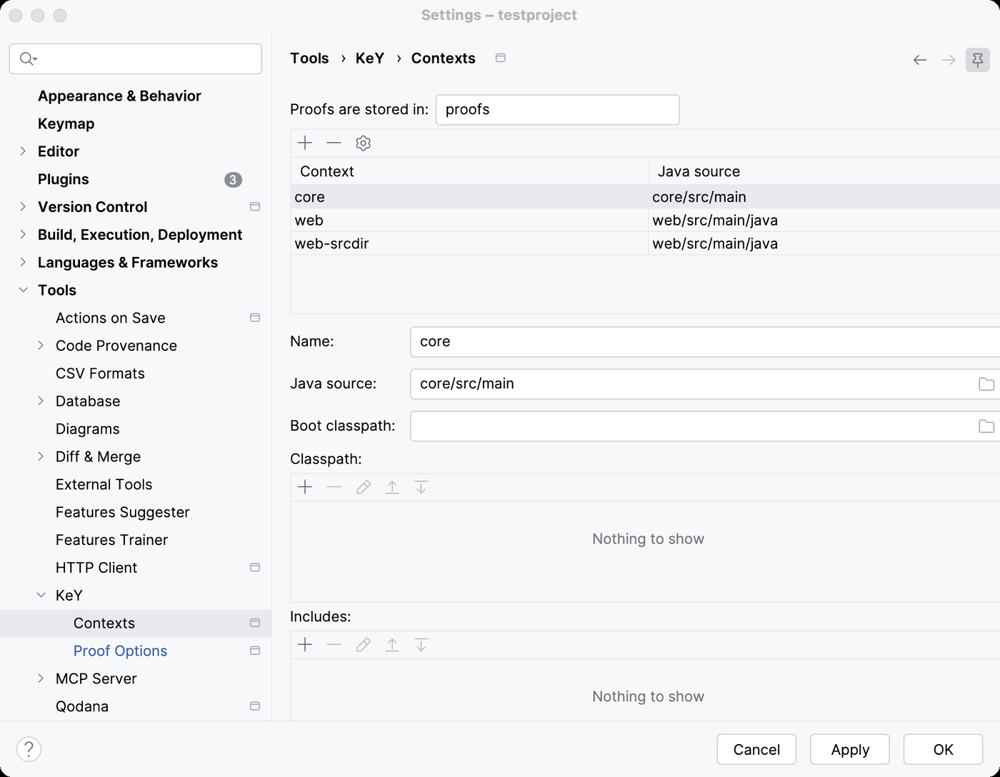
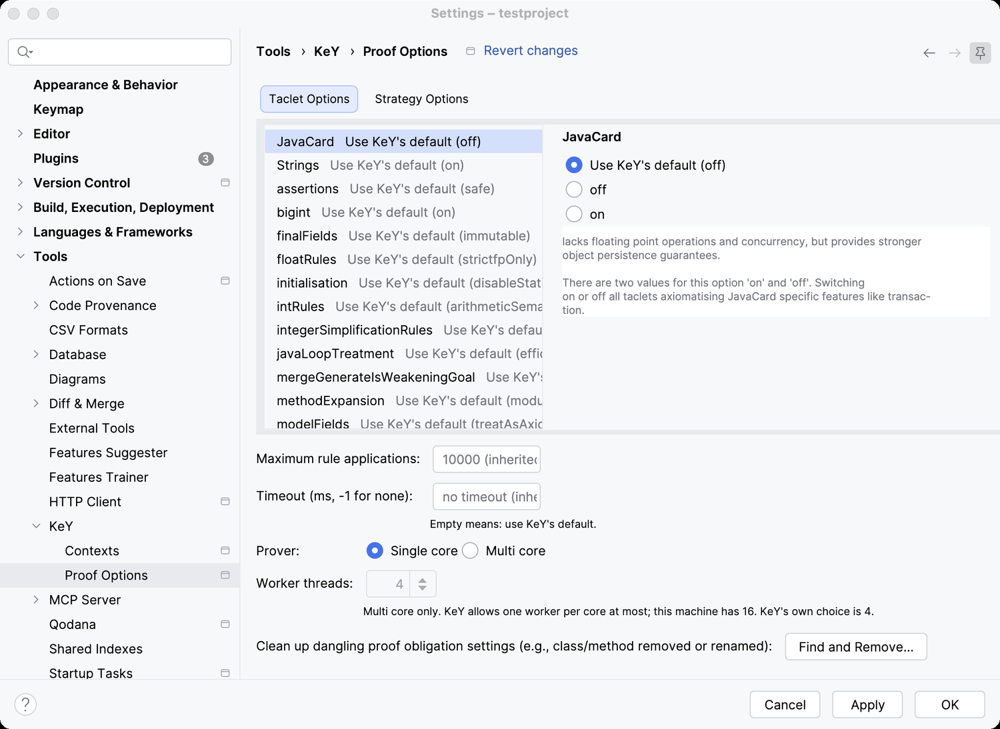

# Settings

Two places: what belongs to the machine, and what belongs to the project.

## Settings → Tools → KeY

The machine's KeY, shared by every project.

| Setting | What it decides |
|---|---|
| **KeY jar** | the `key-*-exe.jar` the plugin starts |
| **Bridge jar** | the `key-ide-common-*-all.jar` it starts alongside |
| **KeY home** | where that KeY keeps its settings, logs and caches: **Project (.key/tool)**, which starts from KeY's own defaults and keeps one project out of another, or **User (~/.key)**, shared with a KeY you start yourself |
| **Verify on save** | replay a context's proofs when its sources change, and prove what is left unproved. On by default |
| **Trash** | what becomes of a proof that a rerun replaced. **Keep everything**, **Empty on quit**, **Max. size** with a number of megabytes, or **Keep for** with a number of days |

Replaced proofs are kept in `proofs/.trash`, which is why the trash has a policy at all: a
rerun that turns out worse than what it replaced can be undone by hand.

## Settings → Tools → KeY → Contexts

The project's own file, `.key/settings.json`, which is meant to be committed.

A **context** is one set of paths KeY can load:

| Field | What it is |
|---|---|
| **Id** | names the context within the project |
| **Java source** | the directory holding the sources to verify |
| **Classpath** | entries holding Java sources KeY reads as library classes |
| **Bootclasspath** | a directory replacing KeY's own JavaRedux, when you need your own |
| **Includes** | further `.key` files to include |

Paths are stored relative to the project when they lie inside it, so the file travels with
the project. **Apply** checks them against the rules KeY imposes and reports what it would
refuse, without loading anything.

The page also holds **Proof directory**, where the project stores its proofs, `proofs` by
default.

## Settings → Tools → KeY → Proof Options

The options of a tab are listed on the left with the value each one has; the selected one is
set on the right, with KeY's own explanation of what it means. The limits, the prover and
its worker count are below them, since they hold for whatever the options say.

The settings a proof is attempted with, at three levels: the project, a context, and a
single proof obligation. Each level states only what it changes, so a setting nobody states
is the one KeY uses by default.

- **Taclet options** — the choices KeY read from its rule files, for example how method
  calls are treated. These change *what* is proved.
- **Strategy options** — how the proof is searched, for example loop treatment or
  arithmetic. These change how long it takes, not what it means.
- **Max. rule applications** — how many rule applications one attempt may make.
- **Timeout** — how long one attempt may take, in milliseconds. KeY's `-1` means no
  timeout. A field left empty inherits from the level above.

Every option is offered with KeY's own name and explanation, so the wording matches KeY's
own dialogs. **Clean up dangling proof obligation settings** removes what is left behind
when a method has been renamed or removed.

## The prover

One choice per project, in the tool window's toolbar rather than on a settings page,
because it is the kind of thing you change while working: **SC** for the single-threaded
prover, or **MT** with a number of workers for the parallel one. KeY decides between them
from a setting that belongs to the prover rather than to a proof, so it holds for every
proof of the project.
